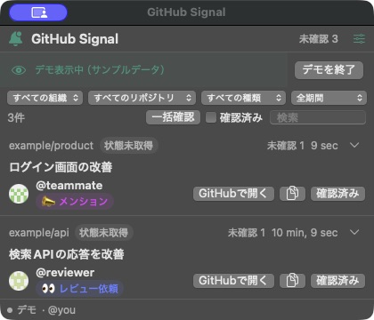

# GitHub Signal

レビュー依頼をPRごとに整理して、あとで戻れる。

GitHub Signalは、GitHub CLIを使う開発者向けのMac・Windows常駐アプリです。個人宛てのレビュー依頼やメンション、自分のPRへのコメント・レビューをまとめて確認できます。



画像はサンプルデータ。実際のリポジトリ名・PR・投稿者は含まない。

## はじめる

[Releasesから最新版をダウンロード](https://github.com/zimathon/github-notification/releases/latest)

| OS | 配布ファイル | 対応環境 |
| --- | --- | --- |
| Mac | `*-macos-arm64.zip` | Apple Silicon・macOS 13以降 |
| Windows | `*-windows-x64.zip` | Windows 11 x64（.NET同梱） |

1. ZIPを展開する。Macはアプリをアプリケーションフォルダへ移し、Windowsは`GitHubSignal.exe`を起動する。
2. GitHub CLIをインストールし、ログインする。

   ```sh
   # Mac
   brew install gh
   # Windows（PowerShell）
   winget install --id GitHub.cli -e
   # 共通
   gh auth login --hostname github.com --web
   ```

3. アプリの「通知を開始」（Windowsは「開始」）を押し、設定のテスト通知で表示を確認する。OSから通知許可を求められたら許可する。

配布版はMacのDeveloper ID署名・公証、Windowsのコード署名を行っていないため、OSが起動時に警告する場合がある。

## 使う

- **同じPRをまとめて表示**。メニューバー／タスクトレイで未確認件数を確認できる。
- **✅ 承認・👀 レビュー依頼などを区別**。PRのOpen・Draft・マージ済み・クローズも表示する。
- **タイトルからGitHubへ移動**。開いても未確認のまま残る。確認済みの操作は⌘Z（WindowsはCtrl+Z）で取り消せる。
- **スターで後から見返す**。PR・Issueを保存し、確認済みでもスター付き一覧に残せる。
- **組織・リポジトリ・種類・日付で絞り込み**。「一括確認」で表示中のPRをまとめて確認済みにできる。
- **通知対象は設定で変更**。一覧の表示フィルタとは別に、通知する組織を指定できる。

ウィンドウを閉じても監視は続く。アプリ終了中やPCのスリープ中は止まる。新しいバージョンは通知で案内し、更新は手動で行う。

詳しい設定・権限・トラブル対応・ビルド方法は[詳細ガイド](docs/usage.md)を参照。
